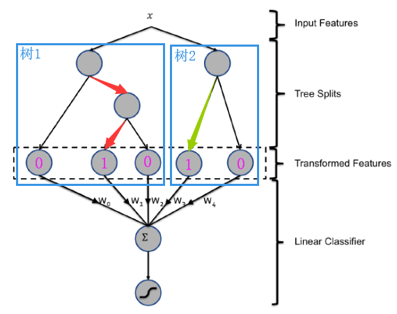

# 广告点击率(CTR)预测经典模型 GBDT + LR 理解与实践（附数据 + 代码）

CTR预估早期使用最多的方案是逻辑回归(LR)，LR 性能非常高，但是其效果十分依赖于大量的特征工程。但是手动构造许多有用特征费时费力，因此需要有更自动化的方法来发现有效特征并构造组合特征。

2004 年Facebook 在论文 Practical Lessons from Predicting Clicks on Ads at Facebook 中提出的 GBDT + LR 模型给出了一个可行的解决方案。

## GBDT + LR 模型

### 基本思想

GBDT 基于集成学习中的boosting思想，每次迭代都在减少残差的梯度方向新建立一颗决策树，迭代多少次就会生成多少颗决策树，不断减少误差。假设GBDT由两颗树构成，如下图中的 树1 和 树2 ：



对于输入的样本特征，每一颗树都最终都会到达叶子节点，如图中的红色箭头和绿色箭头所示。将是否落在叶节点上用 0  与 1 表示，则得到的01编码序列就可以作为下一层LR模型的特征来完成CTR的预估任务。

具体来说，对于有三个叶节点的树1而言，按照红色箭头的路径，落在了第2个叶子节点上，则树1输出的编码为[0, 1, 0]。同理，对于树2而言，其输出的编码为 [1, 0]。将所有树的编码拼接起来就得到了 [0, 1, 0, 1, 0]，此编码就可以作为该样本的新特征使用。最后将得到的[0, 1, 0, 1, 0] 作为特征输入到LR模型，完成CTR的预估。

## 代码实现

下面介绍其代码实现，相关的代码与数据可以从此处获得：。为了突出重点，本文只说明代码中的关键部分。

代码将LightGBM作为GBDT使用，LR模型则使用Sklearn内置的方法。 假设使用32棵树，且每棵树有64个叶节点，则训练这样的模型代码如下：

```python
n_estimators = 32
num_leaves = 64
# 开始训练gbdt，使用100课树，每课树64个叶节点
model = lgb.LGBMRegressor(objective='binary',
                          subsample= 0.8,
                          min_child_weight= 0.5,
                          colsample_bytree= 0.7,
                          num_leaves=num_leaves,
                          learning_rate=0.05,
                          n_estimators=n_estimators,
                          random_state = 2020)
model.fit(x_train, y_train,
          eval_set = [(x_train, y_train), (x_val, y_val)],
          eval_names = ['train', 'val'],
          eval_metric = 'binary_logloss',
          verbose=0)
```

接下来就是要得到每一条训练数据落在了每棵树的哪个叶子结点上：

```python
# pred_leaf = True 表示返回每棵树的叶节点序号
gbdt_feats_train = model.predict(train, pred_leaf = True)

# 打印结果的 shape：
print(gbdt_feats_train.shape)
# 打印前5个数据：
print(gbdt_feats_train[:5])

# 同样要获取测试集的叶节点索引
gbdt_feats_test = model.predict(test, pred_leaf = True)
```

输出结果如下：

> ```
> (1599, 32)
> [[ 7  8 13  1 16 17 29  7 12  9 16  5 22  4 27  3 21 21 10 12  2 18 23 19
>   25  3 25  7  1 23  9  2]
>  [ 1 16 17 12 16 12 17  9  1  1 22 17 34 36 29 29  7  4 16 19 24  7 32 18
>   15 38 32 27 32 11 32 37]
>  [20 30 24 46 34  2 26 39 24 32 17  2  2  0  2 18  7 39 28 31 22 20 21  0
>   15 35 36 34 33 10 34 21]
>  [29 20 29 18 42 26 29  6 10  9 20 19 14 43 14 17 23 17 27 16 25 27 42 43
>   27 18 43 12 11 21 42 16]
>  [ 2 12  8  6  2 34 30  2  2 16 14  5  8 26 15 13 23 12  1  1  7 16 20 40
>   22 14 27 28 17 24  7 38]]
> ```

上面的输出中，(1599, 32) 表示一共有 1599 个训练样本，每个样本都得到32棵树叶节点序号。接下来输出的二维数组就展示了前5条训练数据落在了每棵树的哪个叶子结点上。

接下来，我们需要将这些叶节点需要进行one-hot编码，以形成LR可以理解的特征：

```python
# 将 32 课树的叶节点序号构造成 DataFrame，方便后续进行 one-hot
gbdt_feats_name = ['gbdt_leaf_' + str(i) for i in range(n_estimators)]
df_train_gbdt_feats = pd.DataFrame(gbdt_feats_train, columns = gbdt_feats_name) 
df_test_gbdt_feats = pd.DataFrame(gbdt_feats_test, columns = gbdt_feats_name)
train_len = df_train_gbdt_feats.shape[0]
data = pd.concat([df_train_gbdt_feats, df_test_gbdt_feats])

# 对每棵树的叶节点序号进行 one-hot
for col in gbdt_feats_name:
    onehot_feats = pd.get_dummies(data[col], prefix = col)
    data.drop([col], axis = 1, inplace = True)
    data = pd.concat([data, onehot_feats], axis = 1)
```

接下来就是构造LR的训练和测试数据：

```python
train = data[: train_len]
test = data[train_len:]

# 划分 LR 训练集、验证集
x_train, x_val, y_train, y_val = train_test_split(train, target, test_size = 0.3, random_state = 2018)
```

开始训练LR：

```python
# 开始训练lr
lr = LogisticRegression()
lr.fit(x_train, y_train)
# 对测试集预测
y_pred = lr.predict_proba(test)[:, 1]
```

到此为止，关键代码的说明也结束了，总体来看实现起来并不复杂。


> 在介绍这个模型之前，我们先来介绍两个问题：
> 1）为什么要使用集成的决策树模型，而不是单棵的决策树模型：一棵树的表达能力很弱，不足以表达多个有区分性的特征组合，多棵树的表达能力更强一些。可以更好的发现有效的特征和特征组合
> 2）为什么建树采用GBDT而非RF：RF也是多棵树，但从效果上有实践证明不如GBDT。且GBDT前面的树，特征分裂主要体现对多数样本有区分度的特征；后面的树，主要体现的是经过前N颗树，残差仍然较大的少数样本。优先选用在整体上有区分度的特征，再选用针对少数样本有区分度的特征，思路更加合理，这应该也是用GBDT的原因。

## 一些思考

**为什么GBDT+LR有效果**？

1，GBDT模型中每棵树到达每个叶节点的路径都是不同的，因此编码为1的地方都代表了一种特征的划分与组合方式。

2，由于树的每条路径，是通过最小化均方差等方法最终分割出来的有区分性路径，根据该路径得到的特征、特征组合都相对有区分性，效果理论上不会亚于人工经验的处理方式。

3，LR对于稀疏特征的拟合能力比较好。

**为什么使用GBDT而不是RF**？

RF虽然也学习了很多棵树，但是不同的树之间没有明显的关系。而GBDT每棵树都在学习前面棵树不足的部分，GBDT最开始学到的树，特征分裂主要体现对多数样本有区分度的特征；后面学到的树，主要体现的是经过前N颗树，残差仍然较大的少数样本。因此每颗树学习到的特征划分与组合方式又都有所区别，更能捕捉到有效的特征。


参考文章：

[推荐系统遇上深度学习(十)--GBDT+LR融合方案实战](https://zhuanlan.zhihu.com/p/37522339)

[腾讯大数据：CTR预估中GBDT与LR融合方案](http://www.cbdio.com/BigData/2015-08/27/content_3750170.htm)

[gbdt-lr](https://github.com/wangru8080/gbdt-lr)
